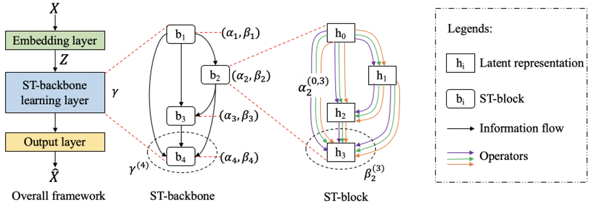
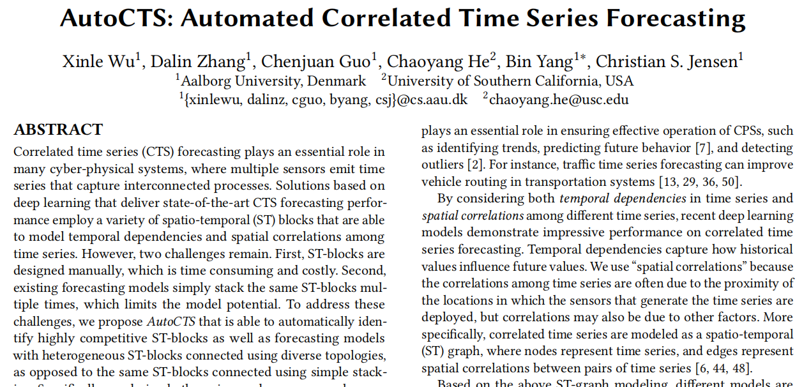
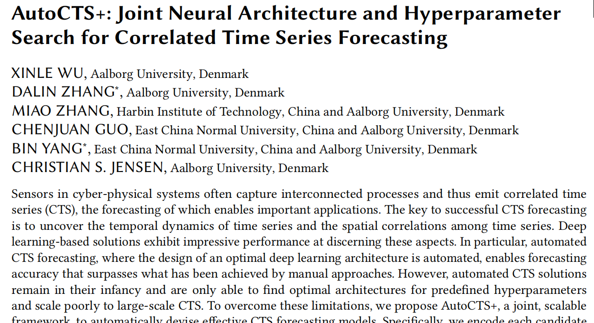
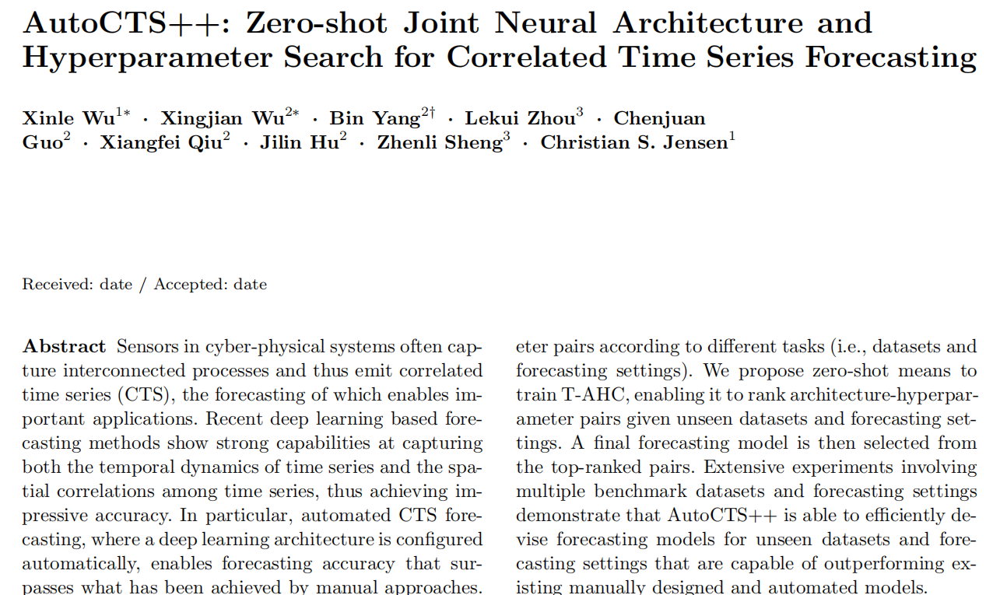

<!-- # AutoCTS Series Overview -->

# Algorithms

<!-- ## Table of Contents

1. [AutoML methods introduction](#AutoML-methods-introduction)
1. [AutoCTS](#AutoCTS)
1. [AutoCTS+](#AutoCTS+)
1. [AutoCTS++](#AutoCTS++)
1. [FACTS: Fully Automated Correlated Time Series Forecasting](#FACTS:-Fully-Automated-Correlated-Time-Series-Forecasting) -->

## AutoML methods introduction
AutoCTS is a series of automated **Neural Architecture Search (NAS)**  frameworks designed for **Correlated Time Series (CTS)** forecasting. The AutoCTS series progressively addresses the following challenges in NAS for CTS forecasting.

1. **Lack of a search space for CTS**: Existing NAS methods lack a specific search space for CTS forecasting, and using all S/T-operators results in an excessively large search space. Additionally, most existing NAS methods focus on identifying one optimal cell while assuming a fixed design structure.
2. **Lack of a joint search space for hyperparameters and architectures**: Existing automated CTS forecasting methods often relies on predefined settings that can lead to suboptimal performance.
3. **Lack of support for zero-shot search ability for unseen tasks**: Existing automated CTS forecasting methods rely on fully supervised, task-specific models, which makes it costly to perform new searches for diverse datasets and forecasting settings.
4. **Lack of automated design methods for the search space**: The search space is still designed manually, which may yield suboptimal performance and also violates the goal of AutoML, namely to automate the entire process.

## AutoCTS

AutoCTS proposes an innovative search space specifically designed to CTS tasks, featuring both a variety of ST-blocks and diverse topological structures.

- The search space of AutoCTS consists of a micro search space and a macro search space. The micro search space constructs ST-blocks by combining temporal and spatial operators, while the macro search space is responsible for establishing the topological relationships between ST-blocks.
- AutoCTS employs a bi-level optimization algorithm aimed at end-to-end training of the macro-DAG and multiple heterogeneous micro-DAGs, focusing solely on optimizing architecture parameters.



## AutoCTS+

With the architecture search space of AutoCTS established, AutoCTS+ further implements a joint search space for hyperparameters and neural architectures, and modifies the optimization strategy to reduce both time and memory consumption.

- Building on the AutoCTS architecture search space, AutoCTS+ designs a joint search space for architectures and hyperparameters, using dual graph encoding to unify the search space.
- Instead of the gradient-based optimization strategy, AutoCTS+ adopts a comparator-based approach, collecting <model, performance> metadata using approximated metrics, thus significantly reducing time consumption.
- AutoCTS+ employs transfer learning to minimize time cost when transferring to unseen datasets.


## AutoCTS++

While AutoCTS+ utilizes transfer learning to reduce costs for unseen datasets, it still lacks a zero-cost transfer mechanism. In AutoCTS++, a task-aware module is proposed, achieving zero-cost generalization for unseen tasks.

- AutoCTS++ features a novel Task-aware Architecture Hyperparameter Comparator (T-AHC) that encodes task-specific representations. Through pre-training on upstream tasks, it identifies which architectures are suitable for specific tasks, enabling zero-cost generalization for downstream tasks.


## FACTS: Fully Automated Correlated Time Series Forecasting

Building on AutoCTS++, FACTS further automates the design of the search space and accelerates the training of architectures found during the search on downstream tasks, resulting in a fully automated architecture search process that takes minutes.

- FACTS can automatically design the search space based on the current task, gradually refining it through an iterative pruning process, replacing manual rule definitions and enhancing the potential to discover better architectures.
- FACTS introduces a novel parameter inheritance mechanism, allowing architectures discovered for downstream tasks to inherit parameters from previously trained similar architectures, thus accelerating and enhancing the training process on downstream tasks.


<h3 >Paper</h3>
<div class="container">
    <div class="left-column">
        <div class="left-text">
           <a href="https://arxiv.org/pdf/2112.11174" > <h3 style='text-align: left;'>PVLDB 2021</h3></a>
        </div>
            <a href="https://arxiv.org/pdf/2112.11174" target="_blank" rel="noopener" >
            
            </a>
    </div>
    <div class="left-column">
        <div class="left-text">
            <a href="https://arxiv.org/pdf/2211.16126" > <h3 style='text-align: left;'>SIGMOD 2023</h3></a>
        </div>
                <a href="https://arxiv.org/pdf/2211.16126" target="_blank" rel="noopener" >
                
                </a>
    </div>
    <div class="left-column">
        <div class="left-text">
            <a href="https://vbn.aau.dk/ws/portalfiles/portal/730426496/AutoCTS_.pdf" > <h3 style='text-align: left;'>VLDBJ 2024</h3></a>
        </div>
                <a href="https://vbn.aau.dk/ws/portalfiles/portal/730426496/AutoCTS_.pdf" target="_blank" rel="noopener" >
                
                </a>
    </div>
</div>

<h3 >Cite us</h3>
<div class="container" style="gap:10px">
    <div class="right-column">
   ```
    @article{Wu2021autocts,
        title     = {AutoCTS: Automated Correlated Time Series Forecasting},
        author    = {Xinle Wu and Dalin Zhang and Chenjuan Guo and Chaoyang He and Bin Yang and Christian S. Jensen},
        journal   = {Proc. {VLDB} Endow.},
        year      = {2021},
        pages     = {971--983},
        volume    = {15}
    }
    ```
    </div>
    <div class="right-column" style='margin-left:0px'>
     ```
    @article{Wu2023autocts+,
    title        = {AutoCTS+: Joint Neural Architecture and Hyperparameter Search for Correlated Time Series Forecasting},
    author       = {Xinle Wu and Dalin Zhang and Miao Zhang and Chenjuan Guo and Bin Yang and Christian S. Jensen},
    journal      = {Proc. {ACM} Manag. Data},
    year         = {2023},
    pages        = {97:1--97:26},
    volume       = {1}
    }
    ```
    </div>
    <div class="right-column" style='margin-left:0px'>
     ```
    @article{Wu2024autocts++,
    title        = {AutoCTS++: zero-shot joint neural architecture and hyperparameter search for correlated time series forecasting},
    author       = {Xinle Wu and Xingjian Wu and Bin Yang and Lekui Zhou and Chenjuan Guo and Xiangfei Qiu and Jilin Hu and Zhenli Sheng and Christian S. Jensen},
    journal      = {VLDB J.},
    year         = {2024},
    pages        = {1743--1770},
    volume       = {33}
    }
    ```
    </div>
</div>


<style>
.container {
    display: flex;
    /* width: 80%; */
    max-width: 1200px;
    /* box-shadow: 0 4px 8px rgba(0, 0, 0, 0.1); */
    background-color: #fff;
    gap:10px;
}
.left-column {
    /* flex: 1; */
    /* display: flex;
    flex-direction: column;
    align-items: flex-start; */
    /* padding: 20px; */
    /* margin-left:-135px; */
    /* border-right: 1px solid #ddd; */
    width:322px;
}

.left-column .image {
    /* width: 100%; */
    height: 215px;
    width: 450px; 控制图片最大宽度
    /* height:215px; */
}

.left-column .left-text {
    margin-top: -10px;
    text-align: center;
}

.right-column {
    display: flex;
    flex-direction: column;
    padding-left:0px;
    padding-top:0px;
    width:322px;;
}

.right-column .top-text, .right-column .bottom-text {
    flex: 1;
    margin-bottom: 20px;
    height:170px;
}
.top-text
{
    width:500px;
}
.right-column .bottom-text {
    margin-bottom: 0;
}
.right-column .bottom-text .a {
   color:#1195db;
}

.right-column p {
    margin: 0;
}
        .text-content {
            width:30%;
            padding:0;
            /* margin-right:2%; */
        }
        .text-content h1 {
            font-size:1.5em;
            margin-top:0;
            margin-bottom:0;
        }
        .text-content p {
            font-size:1em;
            margin:0;
        }
        .image-content {
            text-align:center;
            padding:0;
            width:40%;
        }
        .image-content img {
            max-width:100%;
            height:auto;
            box-shadow:0 4px 8px rgba(0, 0, 0, 0.1);
        }
        .download {
            width:30%;
            padding:0;
            display:flex;
            align-items:center;
            text-align:center;
        }
        .download img {
            width:80%;
            height:auto;
        }
        .download a {
            text-decoration:none;
            color:#0073e6;
            margin-top:0.5em;
            font-size:1.5em;
        }
.uuu {
    text-decoration:none;
    color:#1195db;
    margin-top:0.5em;
    font-size:1.5em;
}
 .copy-container {
            max-width: 600px;
            margin: 50px auto;
            text-align: center;
        }
        textarea {
            width: 100%;
            height: 200px;
        }
        button {
            margin-top: 10px;
            padding: 10px 20px;
            font-size: 16px;
        }
        .article-entry .highlight .line 
        {
            font-size:17px;
            line-height:0.8;
        }
        .article-entry .highlight .gutter pre 
        {
            display:none;
        }
</style>