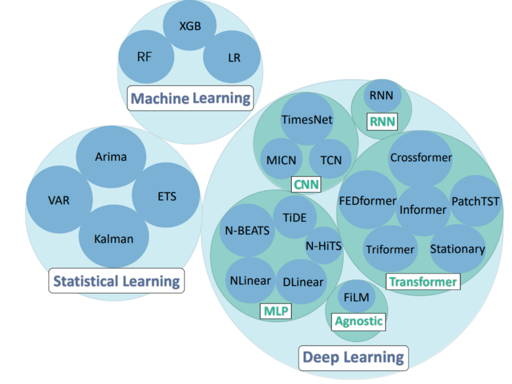

# Algorithms

<!-- 1. [Overview](#Overview) -->

## Methods introduction
TFB evaluated a diverse range of methods, including statistical learning, machine learning, and deep learning methods.

**Statistical Learning (SL)**: ARIMA, ETS, Kalman Filter (Kalman), and VAR

**Machine Learning(ML):** XGB Model (XGB) , Linear Regression (LR), and Random Forest (RF)

**Deep Learning (DL):** 

- RNN-based models (RNN)
- CNN-based models (MICN, TimesNet, and TCN)
- MLP-based models (NLinear, DLinear, TiDE, N-HiTS, and N-BEATS)
- Transformer-based models (PatchTST, Crossformer, and FEDformer, Non-stationary Transformer (Stationary), Informer, and Triformer)
- Model-Agnostic models (FiLM)

## Pipeline introduction

The below figure provides a visual overview of TFB's pipeline.

- The data layer is a repository of univariate and multivariate time series from diverse domains, structured according to their distinct characteristics, frequencies, and sequence lengths. The data is uniformly according to a standardized format. 
- The method layer supports embedding statistical learning, machine learning and deep learning methods. Additionally, TFB is designed to be compatible with any third-party TSF library, such as Darts, TSlib. Users can easily integrate forecasting methods implemented in third-party libraries into TFB by writing a simple Universal Interface, facilitating fair comparisons. 
- The evaluation layer offers support for a diverse range of evaluation strategies and metrics. And it also covers evaluation metrics found in other studies and enables the use of customized metrics for a more comprehensive assessment of method performance. 
- The reporting layer encompasses a logging system for tracking information, enabling the capture of experimental settings to enable traceability. 

