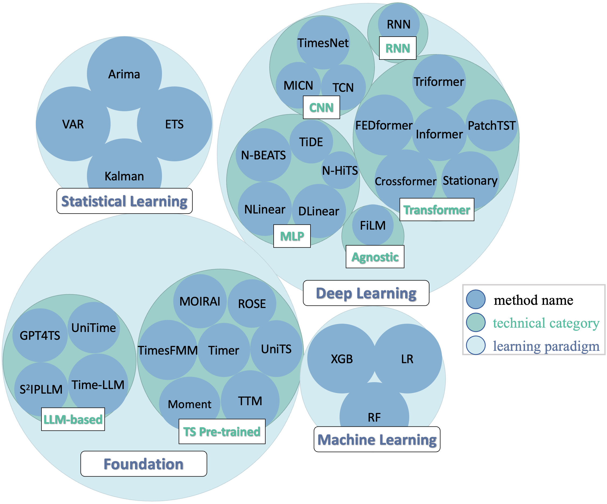

# Algorithms

<!-- 1. [Overview](#Overview) -->
## Table of Contents

1. [Specific Methods introduction](#Specific-Methods-introduction)
<!-- 1. [Steps to include your own method](#Steps-to-include-your-own-method) -->
1. [Foundation Methods introduction](#Foundation-Methods-introduction)

## Specific methods introduction
TFB evaluated a diverse range of methods, including statistical learning, machine learning, and deep learning methods.

**Statistical Learning (SL)**: ARIMA, ETS, Kalman Filter (Kalman), and VAR

**Machine Learning(ML):** XGB Model (XGB) , Linear Regression (LR), and Random Forest (RF)

**Deep Learning (DL):** 

- RNN-based models (RNN)
- CNN-based models (MICN, TimesNet, and TCN)
- MLP-based models (NLinear, DLinear, TiDE, N-HiTS, and N-BEATS)
- Transformer-based models (PatchTST, Crossformer, and FEDformer, Non-stationary Transformer (Stationary), Informer, and Triformer)
- Model-Agnostic models (FiLM)

## Foundation methods introduction
FoundTS envaluated a diverse range of time series foundation models,including  time series pre-trained models pretrained with multi-domain time series and LLM-based models pretrained with large-scale text, along with specific models.

**Time Series Pre-trained Models (TS Pre-trained Models):** 

-  Reconstruction methods: MOIRAI, UniTS, Moment
-  Autoregressive methods: TimesFM, Timer
-  Direct prediction methods: TTM
-  Hybrid pre-training methods: ROSE

**LLM-based Models:**

- Parameter-efficient fine-tuning methods: GPT4TS, SS2IPLLM
- Prompting methods: UniTime, Time-LLM

