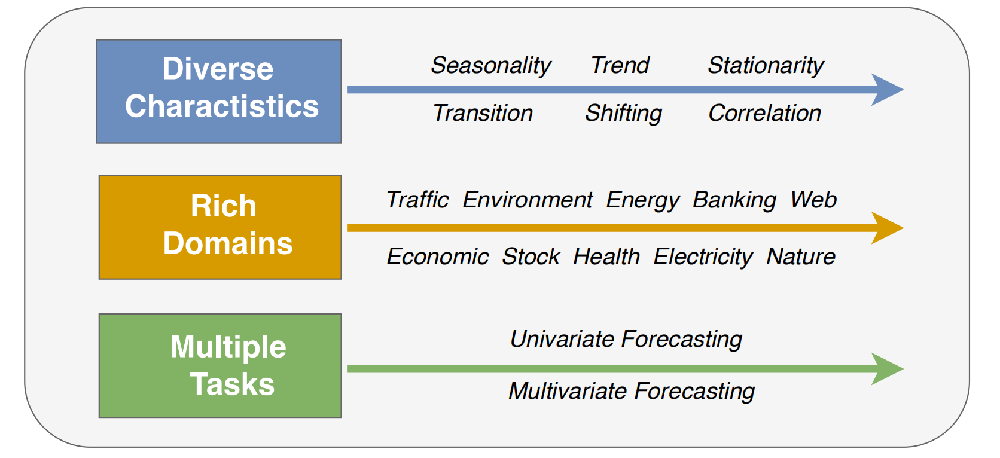
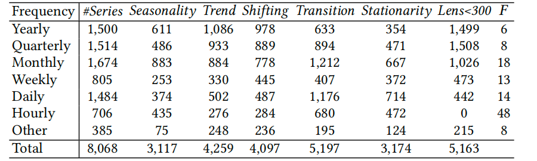
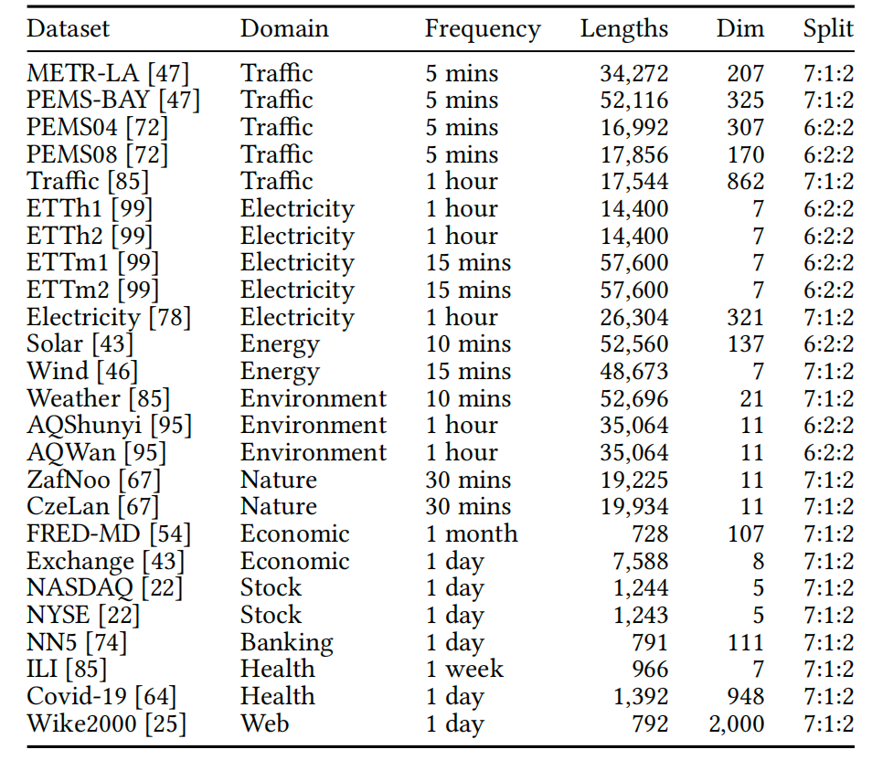

# Datasets

## Table of Contents

1. [Overview](#Overview)

1. [Multivariate time series](#Multivariate-time-series)

1. [Univariate time series](#Univariate-time-series)

<!-- 1. [Dataset comprehensiveness](#Dataset-comprehensiveness) -->

## Overview

  We equip TAB with a robust collection of 18 multivariate and 1,671 univariate datasets, sourced
  from various community literature, providing researchers with a solid reference foundation.

<!-- 

  

    

      
Diverse charactistics:

      TFB covers diverse time series data characteristics, including seasonality, trend,
      stationarity, transition, shifting, and correlation.
    

    

      
Rich domains:

      TFB datasets come from ten different domains, including traffic, electricity, energy, the
      environment, nature, economic, stock markets, banking, health, and the web.
    

    

      
Multiple tasks:

      We cover two fundamental time series forecasting tasks:
      <a href="#Univariate-time-series" class="link">univariate forecating</a> and
      <a href="#Multivariate-time-series" class="link">multivariate forecating</a>.
    

  

  

    
  

 -->

## Multivariate time series

Table 2 lists statistics of the 18 public multivariate time series datasets from 10 domains. We observe that the range of feature dimensions varies from 2 to 72 and the sequence length changes from 5,040 to 1,416,825. Most datasets contain only one multivariate time series except Daphnet, SKAB, Exathlon, ASD, TODS, which have 7, 34, 3, 12 and 12 multivariate time series, respectively. In the experiment, we report the average evaluation metrics on all time series for each dataset.

<table class="my-table" style="width: 90%;">
  <thead>
    <tr>
      <th>Dataset</th>
      <th>Domain</th>
      <th>Dim</th>
      <th>Avg. AR (%)</th>
      <th>Avg Total Length</th>
      <th>Avg Test Length</th>
      <th>Series Count</th>
    </tr>
  </thead>
  <tbody>
    <tr>
      <td>MSL [29]</td>
      <td>Spacecraft</td>
      <td>55</td>
      <td>5.88</td>
      <td>132,046</td>
      <td>73,729</td>
      <td>1</td>
    </tr>
    <tr>
      <td>PSM [1]</td>
      <td>Server Machine</td>
      <td>25</td>
      <td>11.07</td>
      <td>220.322</td>
      <td>87,841</td>
      <td>1</td>
    </tr>
    <tr>
      <td>SMAP [29]</td>
      <td>1,Spacecraft</td>
      <td>25</td>
      <td>9.72</td>
      <td>562,800</td>
      <td>427,617</td>
      <td>1</td>
    </tr>
    <tr>
      <td>SMD [72]</td>
      <td>Server Machine</td>
      <td>38</td>
      <td>2.08</td>
      <td>1,416,825</td>
      <td>708,420</td>
      <td>1</td>
    </tr>
    <tr>
      <td>SWAT [51]</td>
      <td>Water treatment</td>
      <td>51</td>
      <td>5.78</td>
      <td>944,919</td>
      <td>449,919</td>
      <td>1</td>
    </tr>
    <tr>
      <td>SWAN [4]</td>
      <td>Space Weather</td>
      <td>38</td>
      <td>23.8</td>
      <td>120,000</td>
      <td>60,000</td>
      <td>1</td>
    </tr>
    <tr>
      <td>Creditcard [12]</td>
      <td>Finance</td>
      <td>29</td>
      <td>0.17</td>
      <td>284,807</td>
      <td>142,404</td>
      <td>1</td>
    </tr>
    <tr>
      <td>GECCO [53]</td>
      <td>Water treatment</td>
      <td>9</td>
      <td>1.25</td>
      <td>138,521</td>
      <td>69,261</td>
      <td>1</td>
    </tr>
    <tr>
      <td>CICIDS [68]</td>
      <td>Web</td>
      <td>72</td>
      <td>1.28</td>
      <td>170,231</td>
      <td>85,116</td>
      <td>1</td>
    </tr>
    <tr>
      <td>CalIt2 [5]</td>
      <td>Visitors flowrate</td>
      <td>2</td>
      <td>4.09</td>
      <td>5,040</td>
      <td>2,520</td>
      <td>1</td>
    </tr>
    <tr>
      <td>Genesis [76]</td>
      <td>Machinery</td>
      <td>18</td>
      <td>0.31</td>
      <td>16,220</td>
      <td>12,616</td>
      <td>1</td>
    </tr>
    <tr>
      <td>Daphnet [5]</td>
      <td>Movement</td>
      <td>9</td>
      <td>5.75</td>
      <td>87,724</td>
      <td>58,483</td>
      <td>7</td>
    </tr>
    <tr>
      <td>SKAB [32]</td>
      <td>Machinery</td>
      <td>8</td>
      <td>3.65</td>
      <td>10,505</td>
      <td>1,100</td>
      <td>34</td>
    </tr>
    <tr>
      <td>NYC [11]</td>
      <td>Transport</td>
      <td>3</td>
      <td>0.57</td>
      <td>17,520</td>
      <td>4,416</td>
      <td>1</td>
    </tr>
    <tr>
      <td>Exathlon [31]</td>
      <td>Application Server</td>
      <td>multi</td>
      <td>8.71</td>
      <td>131,610</td>
      <td>72,974</td>
      <td>3</td>
    </tr>
    <tr>
      <td>ASD [41]</td>
      <td>Application Server</td>
      <td>19</td>
      <td>1.55</td>
      <td>12,848</td>
      <td>4,320</td>
      <td>12</td>
    </tr>
    <tr>
      <td>PUMP [18]</td>
      <td>Water treatment</td>
      <td>44</td>
      <td>6.54</td>
      <td>220,302</td>
      <td>143,401</td>
      <td>1</td>
    </tr>
    <tr>
      <td>TODS [37]</td>
      <td>Synthetic</td>
      <td>5</td>
      <td>6.35</td>
      <td>20,000</td>
      <td>5,00</td>
      <td>12</td>
    </tr>
  </tbody>
</table>

<!--  -->

Table 2: Statistics of multivariate datasets

(AR: anomaly ratio, multi means the dimensionality of the dataset is different for each series).

## Univariate time series

Table 3 summarizes statistical information of the univariate datasets. The first seven datasets (split by horizontal line) are the most commonly used and are proposed for univariate time series originally. The remaining nine datasets are transformed from multivariate time series, which is consistent with TAB-UAD [58 ]. Specifically, for multivariate time series, we treat it as multiple univariate time series. We then run the AD method on each univariate time series separately and retain those univariate series where at least one method achieves AUC-ROC > 0.85. To ensure data quality, we proceed to filter according to the following two rules: 1) have no anomaly; 2) have anomaly ratio > 10% [66 ], resulting in a total of 1,671 time series. Although NAB, Yahoo are blamed to be too trivial, we still believe they are valuable since a good method should perform well on both challenging and trivial datasets.

<!--  -->

<table class="my-table1">
  <thead>
    <tr>
      <th>Dataset</th>
      <th>Domain</th>
      <th>Avg. AR(%)</th>
      <th>Avg Total Length</th>
      <th>Avg Test Length</th>
      <th>Series Count</th>
    </tr>
  </thead>
  <tbody>
    <tr>
      <td>GAIA</td>
      <td>AIOps</td>
      <td>1.22</td>
      <td>9,574.4</td>
      <td>8,617.2</td>
      <td>193</td>
    </tr>
    <tr>
      <td>ECG [52]</td>
      <td>Health</td>
      <td>4.89</td>
      <td>229,990.9</td>
      <td>206,991.8</td>
      <td>22</td>
    </tr>
    <tr>
      <td>IOPS [63]</td>
      <td>Web</td>
      <td>2.15</td>
      <td>101,430.7</td>
      <td>91,288.2</td>
      <td>11</td>
    </tr>
    <tr>
      <td>KDD21 [33]</td>
      <td>Multiple</td>
      <td>0.58</td>
      <td>65,803.1</td>
      <td>47,222.4</td>
      <td>247</td>
    </tr>
    <tr>
      <td>MGAB [74]</td>
      <td>Mackey-Glass</td>
      <td>0.20</td>
      <td>100,000.0</td>
      <td>90,000.0</td>
      <td>6</td>
    </tr>
    <tr>
      <td>NAB [2]</td>
      <td>Multiple</td>
      <td>9.82</td>
      <td>6,767.9</td>
      <td>6,091.4</td>
      <td>49</td>
    </tr>
    <tr>
      <td>YAHOO [38]</td>
      <td>Multiple</td>
      <td>0.62</td>
      <td>1,563.1</td>
      <td>1,094.3</td>
      <td>362</td>
    </tr>
    <tr>
      <td>NASA-MSL [7]</td>
      <td>Spacecraft</td>
      <td>4.00</td>
      <td>5,008.7</td>
      <td>2,818.5</td>
      <td>23</td>
    </tr>
    <tr>
      <td>NASA-SMAP [7]</td>
      <td>Spacecraft</td>
      <td>2.16</td>
      <td>10,536.8</td>
      <td>7,932.9</td>
      <td>36</td>
    </tr>
    <tr>
      <td>Daphnet [6]</td>
      <td>Movement</td>
      <td>3.38</td>
      <td>12,342.9</td>
      <td>11,108.6</td>
      <td>21</td>
    </tr>
    <tr>
      <td>GHL [19]</td>
      <td>Machinery</td>
      <td>0.25</td>
      <td>200,001.0</td>
      <td>180,001.0</td>
      <td>2</td>
    </tr>
    <tr>
      <td>Genesis [76]</td>
      <td>Machinery</td>
      <td>0.31</td>
      <td>16,220.0</td>
      <td>14,598.0</td>
      <td>1</td>
    </tr>
    <tr>
      <td>OPP [64]</td>
      <td>Movement</td>
      <td>4.11</td>
      <td>31,328.5</td>
      <td>28,196.1</td>
      <td>465</td>
    </tr>
    <tr>
      <td>SMD [72]</td>
      <td>Server Machine</td>
      <td>2.63</td>
      <td>25,810.4</td>
      <td>23,229.9</td>
      <td>184</td>
    </tr>
    <tr>
      <td>SVDB [24]</td>
      <td>Health</td>
      <td>4.87</td>
      <td>230,400.0</td>
      <td>207,360.0</td>
      <td>52</td>
    </tr>

  </tbody>
</table>

    <!-- <tr>
      <td><a href="https://proceedings.mlr.press/v89/gasthaus19a.html">Wike2000</a></td>
      <td>Web</td>
      <td>1 day</td>
      <td>792</td>
      <td>2,000</td>
      <td>7:1:2</td>
      <td  title="Wike2000 is daily page views of 2000 Wikipedia pages">Wike2000 is daily page views of 2000 Wikipedia pages</td>
    </tr> -->

Table 3: Statistics of univariate datasets
(AR: anomaly ratio).

